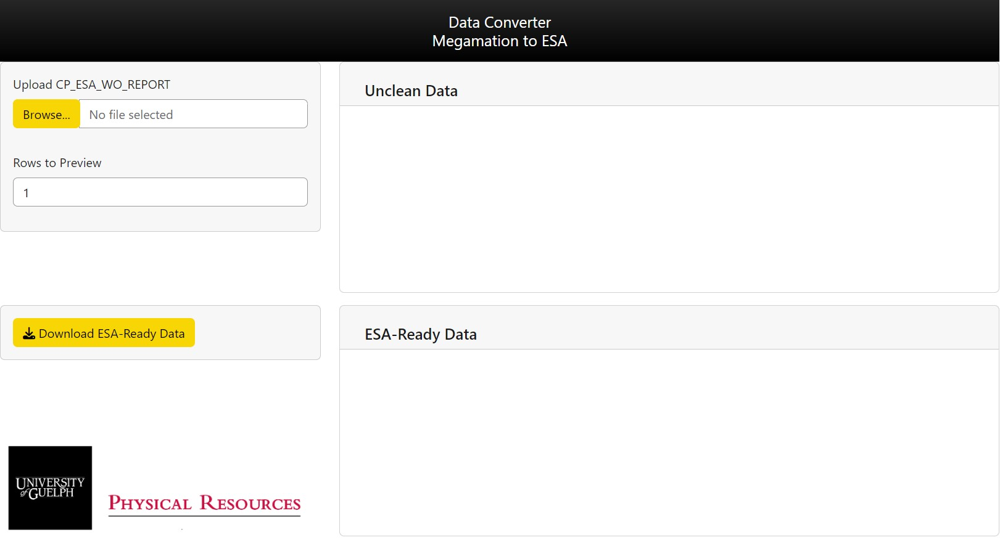

<!-- README.md is generated from README.Rmd. Please edit that file -->

```{r, include = FALSE}
knitr::opts_chunk$set(
  collapse = TRUE,
  comment = "#>",
  fig.path = "man/figures/README-",
  out.width = "100%"
)
```

# esaApp

<!-- badges: start -->
[](https://lifecycle.r-lib.org/articles/stages.html#stable)
[](https://app.codecov.io/gh/asadow/esaApp?branch=master)
[](https://github.com/asadow/esaApp/actions/workflows/R-CMD-check.yaml)
<!-- badges: end -->

esaApp is a Shiny application/R package that allows you to upload a Megamation export and watch it become cleaned for upload to the ESA (Electrical Safety Authority) Online website. The download button will download it straight to your computer.



## Installation

You can install the development version of esaApp like so:

``` r
install_github("asadow/esaApp")
```
