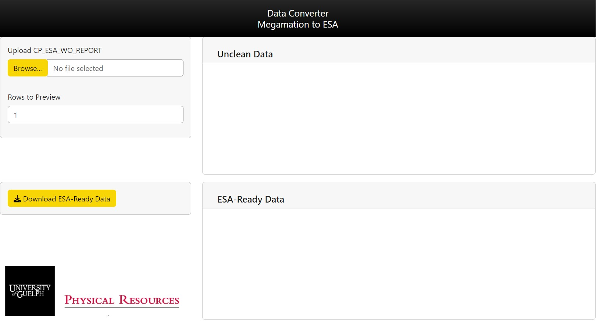

# appDataConverter

<!-- badges: start -->

[](https://lifecycle.r-lib.org/articles/stages.html#stable)
[](https://app.codecov.io/gh/asadow/esaApp?branch=master)
[](https://github.com/asadow/esaApp/actions/workflows/R-CMD-check.yaml)
<!-- badges: end -->

## Overview
`appDataConverter` is a Shiny application designed to facilitate the conversion of Megamation flatfile exports into a format compatible with the ESA (Electrical Safety Authority) of Ontario, Canada. Users can upload a flatfile, view its transformation, and download the result for manual upload to the ESA website. This tool aims to streamline the data handling process for ESA submissions by providing a user-friendly interface and ensuring data accuracy and compatibility.



## Features
- **File Upload:** Securely upload the Megamation flatfile.
- **Data Preview:** Preview the original and the converted data before downloading.
- **File Download:** Download the converted file in the correct format for submission to the ESA.

## Built With
- **[R Shiny](https://shiny.rstudio.com/)** - Web framework for building interactive web applications entirely in R.
- **[golem](https://thinkr-open.github.io/golem/)** - An opinionated framework for building production-grade Shiny applications.

## Installation

1. **Clone the repository:**

```
git clone https://github.com/asadow/appDataEntry.git
```

## Running the App

To deploy the app locally, open the R project and run:

```R
renv::install()
golem::run_dev()
```

