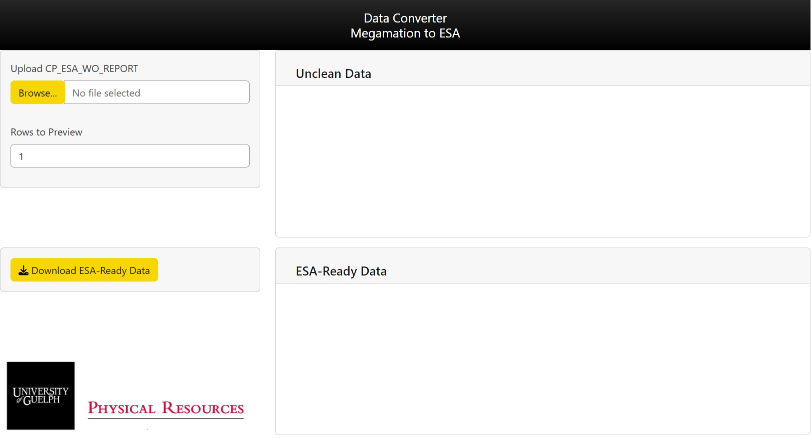

<!-- README.md is generated from README.Rmd. Please edit that file -->

# appDataConverter

<!-- badges: start -->

<!-- badges: end -->

esaApp is a Shiny application/R package that allows you to upload a
Megamation export and see its conversion to a format acceptable by the ESA
Electrical Safety Authority of Ontario, Canada. The file can then be downloaded for manual upload to their website.

